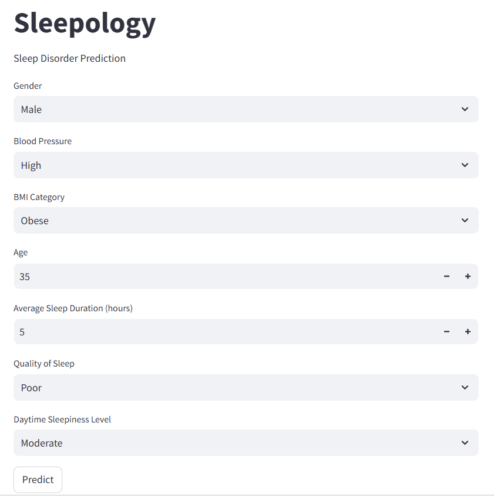
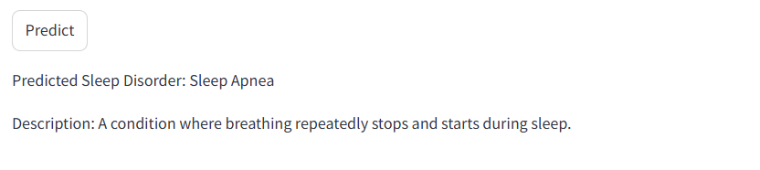

# Sleepology

# Sleep Disorder Prediction Using Machine Learning

This project uses a **Random Forest** model to predict sleep disorders based on user input. The app is deployed using **Streamlit** and allows users to input various factors such as age, gender, blood pressure, sleep quality, BMI, average sleep duration, and daytime sleepiness level. Based on these inputs, the model predicts if a user has any sleep disorders.

## Features

- **User Input:** Collects user data such as age, gender, blood pressure, sleep quality, BMI, average sleep duration, and daytime sleepiness level.
- **Model:** The project uses a **Random Forest** model for classifying sleep disorders.
- **Deployment:** The model is deployed as an interactive web application using **Streamlit**.
- **Predictions:** Based on user input, the model predicts whether the user has any sleep disorders and provides the results in real-time.

## Project Setup

1. Clone the repository:
   ```bash
   git clone https://github.com/your-username/sleep-disorder-prediction.git
   cd sleep-disorder-prediction
   ```

2. Install the required dependencies:
   ```bash
   pip install -r requirements.txt
   ```

## Running the Application

1. Ensure that all dependencies are installed.
2. Run the Streamlit application:
   ```bash
   streamlit run app.py
   ```

3. The app will open in your default web browser, and you can start interacting with it by providing the required inputs.

## User Input Features

The user will be asked to provide the following information:

- **Age:** Your age (in years).
- **Gender:** Your gender (Male, Female, Other).
- **Blood Pressure:** Your blood pressure (High, medium, low).
- **Sleep Quality:** Rate your sleep quality from 1 to 10.
- **BMI:** Your body mass index (Normal Weight, Obese, Overweight)
- **Average Sleep Duration:** How many hours do you sleep on average each night?
- **Daytime Sleepiness Level:** Rate your level of daytime sleepiness (Low, moderate, high)

After submitting the input, the application will predict the likelihood of a sleep disorder based on the data entered.

## How the Model Works

The model uses a **Random Forest Classifier** to predict whether a person is likely to have a sleep disorder. It is trained on historical data that includes features like age, gender, blood pressure, sleep quality, BMI, sleep duration, and daytime sleepiness. Based on the user inputs, the app standardizes the inputs, applies the trained model, and then provides a prediction.

## Deployment

This application is deployed using **Streamlit**, which allows for easy creation of interactive web apps for machine learning projects.

## Model Training and Evaluation

The model is trained using a **Random Forest Classifier**, which is well-suited for classification tasks.
## Example Prediction

After entering the necessary information, you will receive a prediction indicating whether you have any sleep disorders such as **sleep apnea**, **insomnia**, **narcolepsy**, etc.

## Example Screenshots showing Streamlit deployment
INPUTS


OUTPUT



## Requirements

- Python
- Streamlit
- Scikit-learn
- Pandas
- NumPy

You can install the required libraries using:

```bash
pip install streamlit scikit-learn pandas numpy
```
